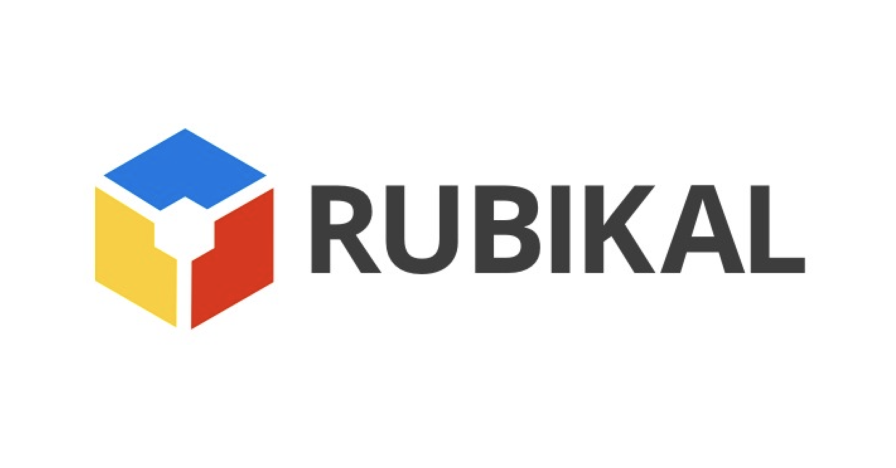
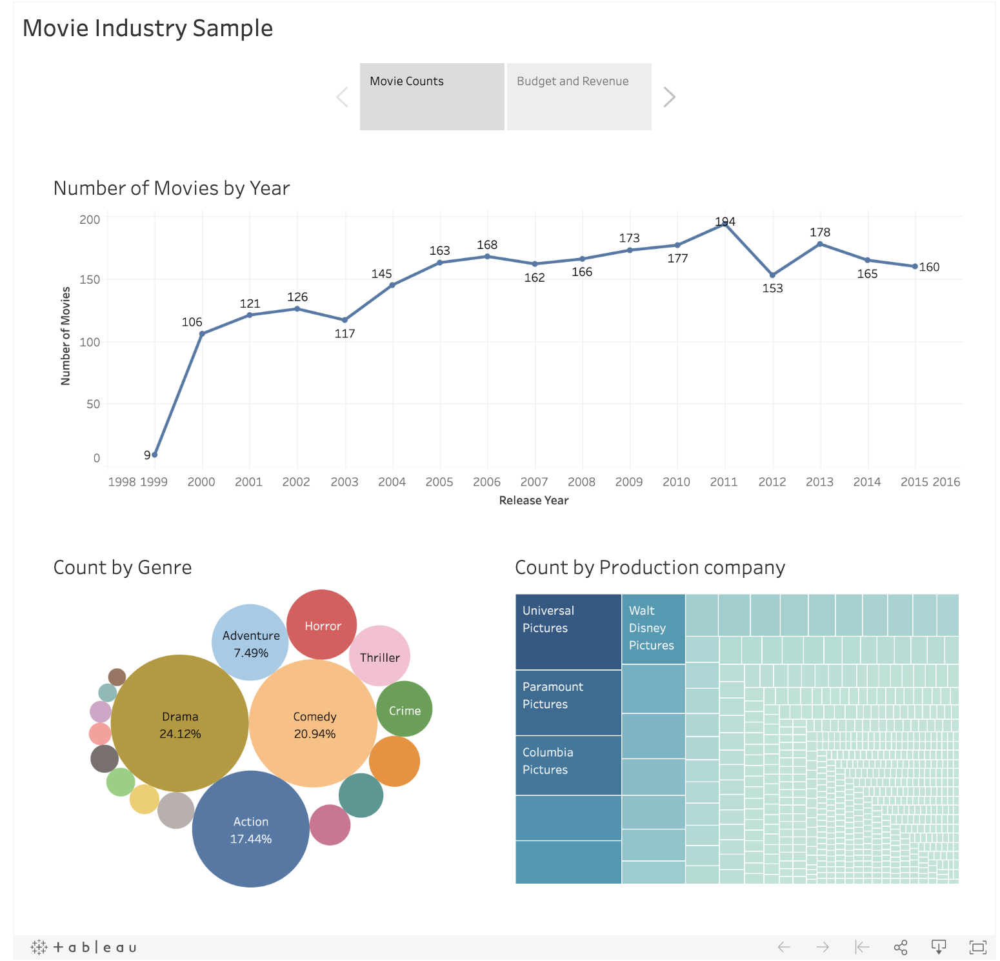

Hello there,

Let me introduce myself !

I am **Kareem Abdelsalam**


## Technical experience

A **Data Analytics Engineer** at



</br>

Working remotely for about 2 years with our partners in the US:


<br><br/>
After I grab my morning coffee , I start my work with the goal of building something like this :
<br><br/>

<br><br/>
So I  checkout a branch and start writing SQL using
<br><br/>


<br><br/>

that usually looks like :
```
{{
  config(
    alias='cool_data_mart_name',
    materialized: table
  )
}}

WITH fact_table AS (
  SELECT * FROM {{ref('fact_table_name')}} WHERE [condition]
  ),

dimention_table_1 AS (
  SELECT
    {{ dbt_utils.star(
        from=ref('dimention_table_1_name'),
        except=[UNWANTED_COLUMN_NAMES],
        , relation_alias='d1'
        )}},
   FROM
      {{ref('dimention_table_1_name')}} AS d1
   WHERE
      [condition]
  ),

dimention_table_2 AS (
  SELECT * FROM {{ref('dimention_table_2_name')}} WHERE [condition]
  ),

final AS (
  SELECT
    f.col1,
    d1.*,
    COALESCE(d2.col123, 'default_value') AS col123,
    ROW_NUMBER() OVER( PARTITION BY id ORDER BY event_at DESC) AS deduplicate
  FROM
    fact_table AS f
  INNER JOIN
    dimention_table_1 AS d1
  ON
    f.foreign_1 = d1.primary
  LEFT JOIN
    dimention_table_2 AS d2
  ON
    f.foreign_2 = d2.primary
  WHERE
    [insert mart conditions]
  QUALIFY
   deduplicate = 1
)
SELECT * FROM final
  ```


Now onto **cool_data_mart_name.yml** to write some tests and documentation !

```
version: 2

models:
  - name: cool_data_mart_name
    columns:
      - name: id
        description: unique identifier of record
        tests:
          - unique
          - not_null
          - dbt_utils.relationships_where:
              to: source('mixpanel', 'events')
              field: event_id

      - name: is_condition
        description: boolean column shows some condition is true or false
        tests:
          - accepted_values:
              values: [TRUE, FALSE]
              quote: false

      - name: first_name
        description: string column showing name of the action taker
        tests:
          - trimmed_spaces


    tests:
      - dbt_utils.expression_is_true:
          expression: "price >= 0"
          condition: "price IS NOT NULL"

```

but it is not always this easy, is it ?

AS you can see above we needed a **custom schema test/ macro** to check for string columns coming from backend without leading or trailing spaces (so that we could easily group by them)

implementation:
```


WITH untrimmed AS (
    SELECT
        DISTINCT COALESCE({{ column_name }}, '') as untrimmed_name

    FROM {{ model }}

),
trimmed AS (

    SELECT
        DISTINCT TRIM( COALESCE({{ column_name }}, '') ) as trimmed_name

    FROM {{ model }}
)
SELECT
    COUNT(*)
FROM
    untrimmed
LEFT JOIN
    trimmed
ON
    untrimmed.untrimmed_name = trimmed.trimmed_name
WHERE
    trimmed_name IS NULL

```
This is just a sample of fully covering the columns with documentation, explanation and tests that communicate and check for assumptions about the data.

Other custom data and schema tests are written to guarantee data integrity for our customers and to alert us if any error happens.

After passing code review and merging into our code base the table/view is materialized in


<br><br/>


 and the tests run daily to check for assumptions about the data.

It is also my responsibility to monitor our **ETL manager/ Orchestrator** which is something very similar to


<br><br/>


and fix any problems that may come and investigate any broken assumptions.


Speaking of Data Warehouses we previously used


<br><br/>


so I am experienced with that as well :)


No I am not done yet !

The rest of my role is building charts and dashboards for our clients in


<br><br/>


and


<br><br/>


I know what you're thinking, where can you find more interactive samples of my dashboards and charts ?

[Just click here!](https://public.tableau.com/profile/kareem.abdelsalam1054#!/)

### Projects
##### Product Analytics
* Participated in defining events to track using tools like Mixpanel new products by the company and for new features in current products
* Cleaned event data coming from tracking tools (deduplication, renaming, inferring missing values)
* Modeled incoming data dimensionally and build custom data marts for each reporting need
* Joined discussions about how to measure goals using available data and communicated data limitations to Product team and management
* Built dashboards using reporting tools
* Tools used: dbt (data build tool)/ Jinja SQL, Tableau, Metabase, Snowflake, Amazon Redshift, Mixpanel, Fivetran

##### Internal Productivity Insights
* In less than a week our data team successfully implemented a robust pipeline to sync and report on the productivity of the whole organization
* My role was architecting the data model of the Marts built from the loaded Jira, Github and CircleCI tables to achieve reporting needs
* Wrote high coverage test cases to ensure data integrity
* Participated in defining KPIs and metrics to track to help management make best use of the tracked data
* Created the dashboards and charts in Tableau and Metabase
* Tools used: Fivetran, Stitch, Tableau, Metabase, Amazon Redshift, SQL, Python task scheduler

##### Future News and Events Prediction
* Participated in building an intelligent large-scale Data Analytics platform that uncovers the full potential of global events and news. Powered by State-of-the-art Machine Learning models, It enables users to visualize, analyze and forecast nation-wide event data and become fully prepared for future opportunities, challenges and crises.
* My role was developing the Machine Learning models on 600M rows of news data
* Cleaned, modeled and Feature Engineered the dataset and enriched data with more features from other related dataset
* Trained and tuned ML models and defined reliable performance metrics to judge model performance
* Tested some out of the box AWS Forecasting tools
* Cooperated with web developers in integrating the API and querying the data to show in the platform
* Tools used: AWS Athena, AWS Glue, AWS SageMaker, AWS Forecast, Python, SQL

### Teaching experience
* I gave Machine Learning Basics courses and seminars for first and second year students in Alexandria university
* Data Careers overview sessions explaining the roles and daily work of Data Analysts, Analytics Engineers and Data Engineers [Like this one](https://www.facebook.com/266710673366368/videos/258332225254051/) and all the series is on the same page
* From time to time I make video tutorials in [my youtube channel](https://www.youtube.com/channel/UCFBpQk3GL2kbk8Fc589JZDQ)


### Publishing and Research
* During my last year in Computer Engineering Bachelor's degree I participated in the Computer Vision research lab (Pose Estimation problem )and also published a [paper on Arabic NLP](https://www.aclweb.org/anthology/W19-4626/)
